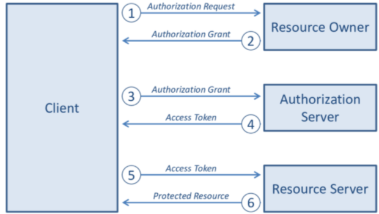
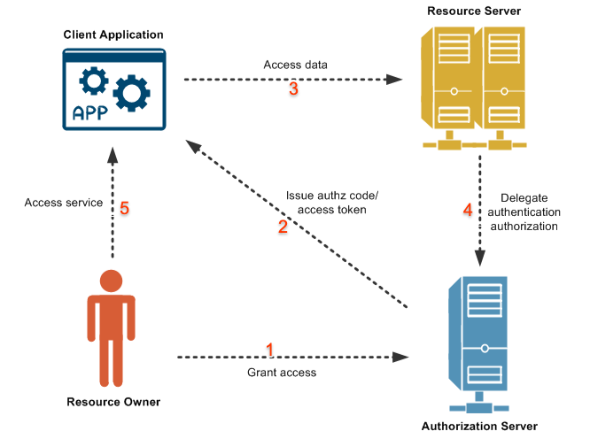
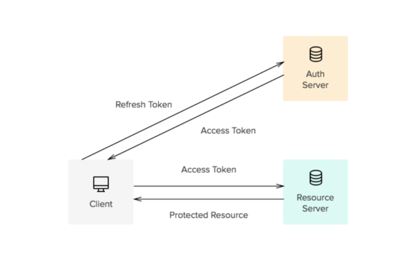

> This blog is not very organized, and mostly my learning notes.

## Basics

### Authentication - “who are you”

This part is only about authentication, not authorization. And only about client
side authentication, not server side (i.e. service account)

Technically OAuth protocol is designed for Authorization, not Authentication.
But OAuth is commonly used for both, thus the authentication flow is actually a
bit weird. OpenId protocol is designed for Authentication.

### Authorization - “what can you access”

The 3 parties involved in this process are: user, auth/identity service,
third-party service (usually a web app). When an web app need to do something
(e.g. access user's contact list), it send the user to the auth service and let
the user sign in and grant permission. Then the auth service give the web app a
token to conduct the action. Then the web app can request access (in this case,
read contact list), and attach the token to the request, so the service provider
knows this is authorized.

## A typical OAuth flow

### Token

### Why tokens?

Because HTTP is stateless, a method for keeping the access state is needed
between client and server. In the old days, session + cookie is used for
authentication. But that means the state is saved in the server-side, thus
having scaling issue (large memory usage when users grow, sync sessions among
load balanced servers, etc.), and cookies can be disabled, or cross-domain is
complex to infeasible. (e.g. Need to log in separately on
`https://forum.example.com` and `https://blog.example.com`).

Tokens are saved in the client side, and sent in the request header, thus
doesn't have these two issues.

### Security

Token are almost always a private-public key encrypted string. And JSON Web
Token (JWT) is commonly used as the format. (These are all for security purpose,
you can technically use any string as a token). This can prevent attackers
modify an existing token to gain access to resources they are not granted. For
example, if a plain text token is `grant-access-to-read-contact-list`, an
attacker can guess a token `grant-access-to-delete-contact-list` and send it
with a malicious request. But if this is encrypted JWT, the backend can easily
validate it.

In detail, there are two types of tokens - access token and refresh token.

- Access token: used to access service
- Refresh token: used to get a new access token when expires

This is another security improvement. It's protecting against stealing other
users' token.

When we set access token to be short-lived, even if the access token is leaked,
the attacker cannot do much with it, as it will be / already expired. On the
client-side, behind the scene, a request is sent to the authentication server
with refresh token attached, and gets new access token.
