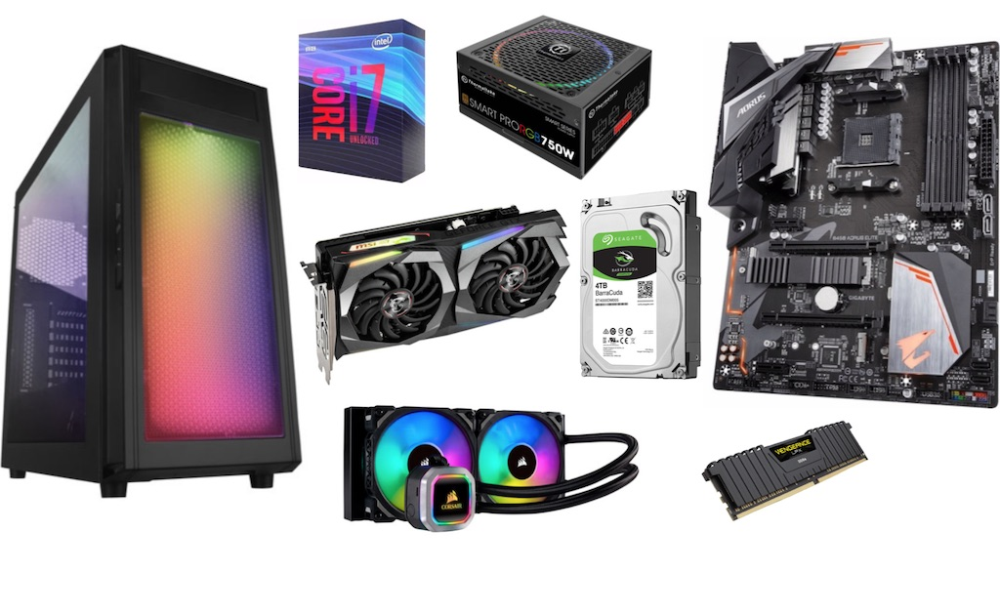

## Why I'm building a PC

I have been thinking about buying a gaming PC for a while. I do have an Xbox and Switch and play them ocassionally. But every now and then, I miss some old games I played on PC when I was young - fancy NBA 2k mods, Commandos, GBA/FC/Arcade emulators. So during this long "shelter in place" time, I decided to pull the trigger!

I had been a long time PC desktop user, and had built my own PC long time ago. So building a PC is not a new thing for me. But it's been so long since I followed any PC parts news, I don't have any idea on what's the latest generation of CPUs, or which Graphic card is good for which level of games.

I initially thought about buying a pre-build PC. But after a very breif search, it became obvious that most pre-built PCs (especially gaming PCs) we can buy are just terrible (Price–performance ratio and/or parts quality). So I started a week of research.

## Basics

If you never built a PC before, watch a few YouTube videos on how to build PC. It's really not rocket science - there're only less than 10 pieces you need to connect together. Most connections are in totally different shape, and fool-proof design, so you can hardly plug it the wrong way.

### CPU

The brain of the computer. It's a small square-shaped chip.

- CPU has two brands - Intel and AMD
- Intel's desktop CPUs are the Core series, which has Core i3, Core i5, Core i7, Core i9. Each generation has all/some of these lineups, where i3 is more entry-level and i9 is high end.
- AMD's current desktop series is Ryzen, which has Ryzen 3, Ryzen 5, Ryzen 7, Ryzen 9. Same as Intel, Ryzen 3 is entry level, and 9 is higher end. There are three generations of Ryzen CPUs - Zen (2017), Zen+ (2018), and Zen 2 (2019). You can know the generation by reading the model number - 1000+, 2000+ and 3000+. E.g. Ryzen 5 3600 is a 3rd (because of 3000+) generation, mid-high end (becuase of 5)

### Motherboard (MoBo)

The black board on the right in the image. Almost all the parts are plugged onto the motherboard, except the power supply. Then you put the mothoerboard inside the case.

- The most important thing is the compatibility with the CPU - the socket interface (shape of the connection) and chipset.
- Current AMD CPUs all require AM4 socket interface. Intel mostly requires LGA 1151.
- Chipset is more comples. I researched AMD: [A/B/X][three number model]. A < B < X, and the larger the number, the newer & better it is.
- Besides that, one big factor for MoBo is the form factor / size: EATX > ATX > Micro ATX > Mini ATX. ATX and Micro are the most common ones.

### Graphic card

Sometimes also referenced as "GPU" (but to be precise, GPU is just the chip on a graphic card). Used for render images. Most CPU/MoBo are capable of rendering images on its own, but if you want to play games, graphic cards is a must. Graphic cards usually come with their own fans. (In the image, the middle one, with two grey fans).

- There's two brands of GPUs - AMD and NVIDIA. Different from CPUs, they are not the only two companies sells graphic cards. Many companies buys GPUs from them, then add different board/caching/cooling/etc. and sell the final graphic cards to consumers. But you always see the GPU model name in the graphic card model name.
- AMD's current GPU series is "Radeon RX", NVIDIA's is "GeForce RTX". Usually the larger number in the model name means better performance.

### Storage

This is where the computer stores data - including the system, your games, files, everything. Two major types are Hard Disk Drive (HDD) and Solid-State Drive (SSD). (At the center of the image, the sliver one with white/green sticker is a HDD)
  
- SSD is much faster than HDD (and also more expensive). Use SSD as much as possible, and HDD only for large storage needs.
- SSD also types/interfaces differences like M.2, SATA, and NVMe. [this](https://youtu.be/kx0ynC8Thlw?t=199) is the best chart explaning them all. M.2 NVMe is the best now.

### RAM (Random Access Memory, aka memory)

It holds data for whatever the computer is performing. e.g. if you are editing a document, the editor and document file is loaded into memory, from your drive. Then when you save, it saves into your drive. (In the image, it's the smaller black thing near the bottom right).

- Just pick DDR4. DDR3 is gradually being deprecated.
- 8G * 2 is the most recommended size / setup nowadays.

### Power supply

As the name suggests, this is connected to your wall outlet and provides power to the computer. (the black box at the top of the image)

- Use some online calculators to calculate the power needed for your parts. Insufficient power supply can lead to poor performance or hardware glitch.
- "80+" is efficiency rating for power supplies. Pick one with at least "80+ Gold" rating if you can.
- Power supply has full-modular, semi-modular, and not modular. It means whether the cables are all connected. The more modular, the easier to manage cables, but more expensive.

### Cooling system

It's the colorful fans at the bottom of the image. It's used to cool down your parts (trust me, heat and electronics doesn't work well together!). CPU always needs an external cooling system. Graphic cards usually comes with cooling (tho, you can optionally add more in some cases).

### Case

The box on the left in the image above. It's a protective container for your valuable parts. Just make sure it has enough space for your motherboard and graphic card.

## Picking my parts

I researched a lot of reviews and gaming PC builds. Now, let's get into my building process.

0. Budget

There're TONS of options for many of those parts, and you can easily get overwhelmed. So first thing first, set a budget. I think https://pcpartpicker.com/guide/ is a good place to get a sense of the budget. I set my budget to around $1000 - about Modest ~ Great gaming build. Note that the price on the site doesn't include monitor and peripheral.

1. CPU - I picked Ryzen 5 3600. AMD is generally considered high price–performance ratio. And most reviews I saw recommends Ryzen. I picked 5 3600 as it's higher end, relatively new model.
1. Graphic card - Most guides recommend ~50% of budget on the graphic card. So I compared RTX 2060 Super, RX 5700XT and a few GPUs around them. From performance tests, RX5700XT is better than 2060 Super, but some reviewers pointed out NVIDIA usually has more stable driver than AMD, and since NVIDIA has more hype in Silicon Valley / stock market :smile:. I chose RTX 2060 Super.
1. Motherboard: A few YouTubers recommended MSI B450 Tomahawk - it's supports Ryzen 5 3600 with a BIOS flash. Other B450's requires installing an older CPU to upgrade the BIOS to support Ryzen 5 3600. When I check online stores, I saw Tomahawk Max, which is slightly newer and better, thus picked it.
1. Storage: Since I know I'll mostly play old games, and I have all of them in my old hard drive. So I know it will be less than 200G in total. I just picked one 500G M.2 PCI-e NVMe. (And I do have 2 old hard drives if I do need more storage)
1. RAM: just picked the highest rating, most rating 8G * 2.
1. Power supply: The power calculator told me I need ~460W. So I picked a 550W 80+ Plus, semi-modular.
1. Case: just picked the one looks nice to me - white case with glass panel on the side.

## Appendix

### Useful links

- [PC part picker](https://pcpartpicker.com/) - really like the part picker, compatibility checking, and price comparison
- [Linus Tech Tips - YouTube channel](https://www.youtube.com/user/LinusTechTips) and his other channels
- [Tech Deals - YouTube channel](https://www.youtube.com/channel/UCCss3QxegBkF8BAetIo0qXA)

### References

- PC parts image from https://blog.bestbuy.ca/computers-laptops-tablets/what-you-need-to-build-your-own-pc
