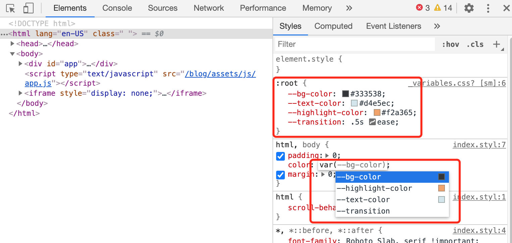

## Use CSS variables

CSS variables (Custom Properties) are available in all popular broswers now. It's easy to think:

> We've been using variables in CSS with SASS/LESS/etc. for a long time. It's good that now we have it natively, but so what?

Yeah yeah, for basic uses, there's almost no difference - just change the variable syntax from `$my-color: #aaa` to `--my-color: #aaa`, and change the reference to the variable from `background: $my-color` to `background: var(--my-color)`. SASS syntax is even more concise. However, native CSS variables has some power that other pre/post-processors do not have.

## Advantage 1: Inherence and overriding

CSS variables follows the same inherence rules of normal CSS rules. In some cases, this can be quite useful. For example, you can use the same CSS code for the card (maybe a component), and change some styles using css variable (instead of passing in a component prop, and set a conditional class).

<css-variables-override/>

## Advantage 2: Editing using JavaScript

You can edit css variables using JavaScript --- `element.style.setProperty('--my-var', newValue);`. And all places using this variable will get updated automatically.

<css-variables-edit/>

In this example, my CSS looks like this:

```css
.title, a {
  color: var(--tab-color);
}
```

And on the tab click, the variable `--tab-color` is updated to the corresponding color.

When using Vue.js, you can set multiple CSS variables automatically by applying `:style="myVars"`, and set a computed property:

```javascript
{
  // ... component code
  computed: {
    myVars () {return {
      '--tab-color': this.tabs[this.activeIndex].color,
      '--font-size': this.getFontSize(),
    }}
  }
}
```

## Advantage 3: edit inside browser devtools



Not a huge deal, but it's very convient to be able to modify CSS variables inside browser devtools. You can change the value of any variable, or assign variables to any element to test it out on the fly.
In comparison, SASS variables are just compiled into values, and there's no way to play with SASS variables in devtools.
