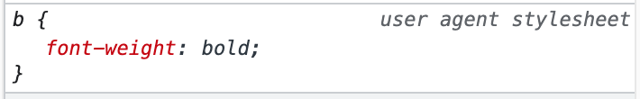
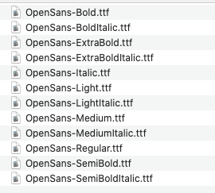
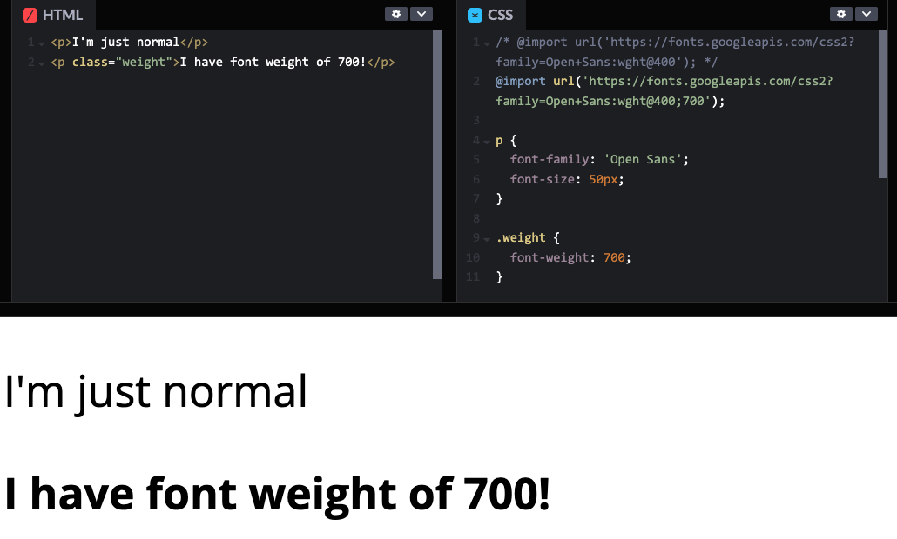
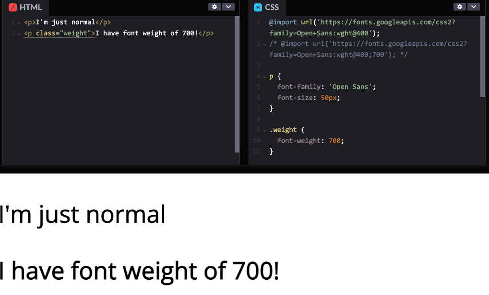
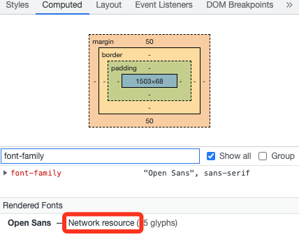
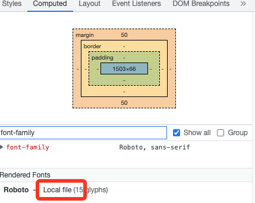
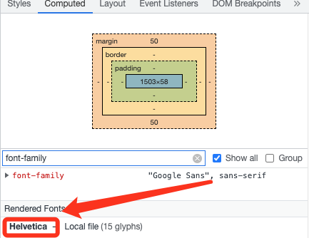

`font-weight` and `<b>` might be one of the first things you learn about HTML & CSS. But there's so much details in it. And there are many hoops you need to jump though to get a text rendered in bold!

Designers - Have you seen that bold text looks gorgeous on your design app, but looks terrible on the final implementation? One possible reason is the font-weight is not handled correctly in CSS.

## TLDR

> - If you load fonts from Google Fonts, remember to include font weight params `?family=Open+Sans:wght@400;700`
> - If you load your own fonts via `@font-face`, remember to define `font-weight`, and use the same `font-family` for all weights of the font.
> - Use CSS if you just want to change the style (bold a font). Use `<strong>`, `<em>`, etc. when you want to convey the meaning of "strong" or "emphasis".

Let's dive deep into it!

## On the CSS level

### HTML - `<b>` is really just CSS

Let's start from the easiest part - what does `<b>` do? It bolds the font, right? How?

Most frontend developer can answer this - browser stylesheet. Just like we have default margin on `<p>`, default underline on `<a>`, the default `font-weight` on `<b>` is defined in browser stylesheet.



So there's no difference on the visually for `span {font-weight: bold}` vs `<b>`. (Unless you used some browser style reset that explicitly has a rule of `b {font-weight: something else}`).

> But do note the semantic HTML - use `<b>`/`<strong>` only when meaningful, and if you just want to bold a text, use `font-weight` [Read more on MDN](https://developer.mozilla.org/en-US/docs/Web/HTML/Element/b#usage_notes)

### `font-weight` values

Now that we cleared HTML, let's really look at the CSS value. Most web dev can name "400 is the same as normal", and "700 is the same as bold" (funny enough, I've always been remembering 600 is bold until today!). [MDN](https://developer.mozilla.org/en-US/docs/Web/CSS/font-weight) has pretty clear list of it - including some lesser known values like `lighter` and `bolder` (they are [relative to the parent](https://developer.mozilla.org/en-US/docs/Web/CSS/font-weight#meaning_of_relative_weights)).

> Why `font-weight` are normally 100's? Checkout "Variable fonts" at the end of this article! Exciting web typography future!

Things gets a little interesting when the font weight you specified is not available, what to use? MDN explained it well in [fallback weights](https://developer.mozilla.org/en-US/docs/Web/CSS/font-weight#fallback_weights). But what does "font weight not available" mean?

## Font files and loading

### Font weight unavailable?!

Normally, fonts come with variations in 2 axis - style (most commonly `italic` & `normal`) and weight (any values from 1 ~ 1000). If you ever downloaded a font (like from [Google fonts](https://fonts.google.com/specimen/Open+Sans)), you will see files like below. Each file is one variable. It's not simply a "Open Sans" file that can magically apply `font-weight` or `font-style` to change the appearance.



Font's are created by people, and each font weight are designed separately. Like the example below, each weight is carefully designed to have the perfect balance. It's not simply "design a font, and magically just **bold** it". So it's common to see fonts with only some weights, and even just one weight.


### How font variations works with font loading

The files are all separate, but in CSS, we normally treat them as one font, and apply `font-weight` or `font-style`, how?

All the magic happens on the [`@font-face` rule](https://developer.mozilla.org/en-US/docs/Web/CSS/@font-face). Font's are loaded into CSS by this (unless using system fonts, which we will discuss below).

```css
/* A block copied from https://fonts.googleapis.com/css2?family=Open+Sans */
@font-face {
  font-family: 'Open Sans';
  font-style: normal;
  font-weight: 400;
  font-stretch: 100%;
  src: url(https://fonts.gstatic.com/s/....woff) format('woff');
  unicode-range: U+0000-00FF, ...;
}

/* This means: "If some text has CSS of font-family: 'Open Sans' and font-weight: 400 and ... then use this woff file to render it. */
```

Whether you load fonts "manually" or via Google Fonts, you are essentially using `@font-face`. The above is part of the CSS you will get when you include "Open Sans" via Google Font.

Do note that, although this (especially the `font-family`, `font-style`, and `font-weight`) looks the same as when you apply a typography, `@font-face` is **"defining what these property values should do"**. (read the last line of comment in the code above)

The part relevant to this discussion is - obviously - `font-weight` here. For a proper font with different weights, the font should be loaded as:

```css
/* A block copied from https://fonts.googleapis.com/css2?family=Open+Sans:wght@400;700 */
@font-face {
  font-family: 'Open Sans';
  font-weight: 400;
  ...
  src: url(https://...fontNormal.woff) format('woff');
}
/* "If a text has CSS of font-family: 'Open Sans', and font-weight: 400, and ..., render it using fontNormal.woff  " */

@font-face {
  font-family: 'Open Sans';
  font-weight: 700;
  ...
  src: url(https://...fontBold.woff) format('woff');
}
/* "If a text has CSS of font-family: 'Open Sans', and font-weight: 700, and ..., render it using fontBold.woff  " */
```

With the 2 meanings combined, you can see when changing the weight value in `p {font-family: 'Open Sans'; font-weight: 400}`, it's actually changing from the 1st `@font-face` rule to the 2nd one, thus using a different font file.

> When using Google Fonts, you need to specify the weights you want to load in the path `?family=Open+Sans:wght@400;700`, otherwise it would only load 400.

By comparison, this is a bad practice:

```css
/* DO NOT load fonts like this! */
@font-face {
  font-family: 'Open Sans Normal';
  src: url(https://...fontNormal.woff) format('woff');
}

@font-face {
  font-family: 'Open Sans Bold';
  src: url(https://...fontBold.woff) format('woff');
}
```

Doing above will basically make `font-weight` property useless. If you want to make a `<p>` from normal to bold, you need to change the `font-family`! It's an anti-pattern.

## Beyond code - Real rendering of the font

So far, we are still in the CSS code. It gets even more interesting with the real rendering of it -

> `font-weight: 700` is not equal to `font-weight: 700`! (in some cases)

<p class="codepen" data-height="300" data-default-tab="css,result" data-slug-hash="ExboxXz" data-user="liyangguang" style="height: 300px; box-sizing: border-box; display: flex; align-items: center; justify-content: center; border: 2px solid; margin: 1em 0; padding: 1em;">
  <span>See the Pen <a href="https://codepen.io/liyangguang/pen/ExboxXz">
  font weight</a> by Yangguang Li (<a href="https://codepen.io/liyangguang">@liyangguang</a>)
  on <a href="https://codepen.io">CodePen</a>.</span>
</p>
<script async src="https://cpwebassets.codepen.io/assets/embed/ei.js"></script>

Try toggle the 2 `@import` rules. You can see the `font-weight: 700` on the same font can be very different thing based on what you load.




Both code has the rule `.weight {font-weight: 700}`, but renders very differently. When the font weight is unavailable, browser will try to bold it (called *faux*), but usually do a poor job. The exact result depends on the font, and likely the browser. (some only bolds a little, some bolds a lot. either way, it's not a bold designed by a typography designer)

### local font vs network font

There's one more catch on loading fonts - Have you experience this: "The site I built shows up as Roboto (or whatever font) on my computer, but my client says it's showing Arial." The reason is usually - you have Roboto installed on your computer locally.

When browser see `p {font-family: Roboto, sans-serif;}` it goes to look for `Roboto`. It can come from a `@font-face` rule you write / imported from Google Fonts. If not found, browser will look for it on your system. If still not found, it will look for the fallback font, all the way to the browser default font.

> First, always make sure you include fonts you are using on the site.

You can use your browser devtool to check if you are using any local fonts. Go to "Element" tab and go to "Computed", scroll down to the bottom, it shows "Rendered Fonts". Below are two examples: one with the font loaded in my CSS, one without. Although in the 2nd example, the text renders Roboto for me, but it won't for anyone who didn't install Roboto font on the system.




> Set proper fallback when using `font-family` - `p {font-family: Roboto, sans-serif;}`

The best practice is at least include the font type (Sans-serif/Serif/Mono), so in the worst case the font is not loaded (CSS issue or network issue), the fallback font from the browser will load the correct type. If you have other fonts in mind, you can also put more than one fallback, like `p {font-family: Roboto, Helvetica, sans-serif;}` is a common usage, as `Helvetica` comes with MacOS (I believe), and looks nicer than many browser default `sans-serif`. But most time, only Sans-serif/Serif/Mono is enough (which is what Google Fonts provided code uses)

You can also use the same devtool "Rendered Fonts" to know which fallback font is currently rendered. Below, I set it to a font not in my CSS nor on my system, so it falls back to my browser's default sans-serif - `Helvetica`.



## The end

This became much longer than I initially thought... Throwing out some awesome resources:

- A ten year old article on AListApart on this topic [Say No to Faux Bold](https://alistapart.com/article/say-no-to-faux-bold/)
- This blog is only talking about using it in CSS. It's a far more complex world when you need to build a design tool to support typography. [Figma talk - I Pressed ⌘B. You Wouldn't Believe What Happened Next](https://www.youtube.com/watch?v=kVD-sjtFoEI)
- Some more [advanced params for Google Fonts](https://developers.google.com/fonts/docs/css2)
- A random site I found listed [browser default fonts for different systems](https://granneman.com/webdev/coding/css/fonts-and-formatting/web-browser-font-defaults)
- As always, many of the CSS details comes from the awesome [MDN](https://developer.mozilla.org/en-US/)


### Variable fonts

(It really worth a new heading.) Have you wondered why `font-weight` are normally 100's? Why not just `1` for thin, `4` for normal, `7` for bold? It's a piece of future-proof thinking baked into it! Now, with the "Variable fonts", we can use `font-weight: 314`, and a lot more granuallar control! Checkout these to learn more:

- [MDN](https://developer.mozilla.org/en-US/docs/Web/CSS/CSS_Fonts/Variable_Fonts_Guide)
- [web.dev](https://web.dev/variable-fonts/)
- [v-fonts](https://v-fonts.com/)
