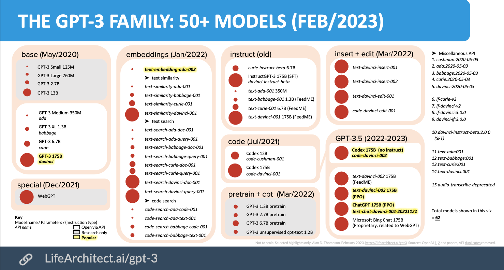
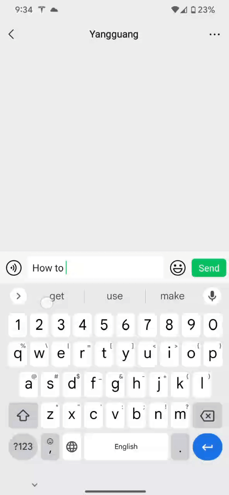
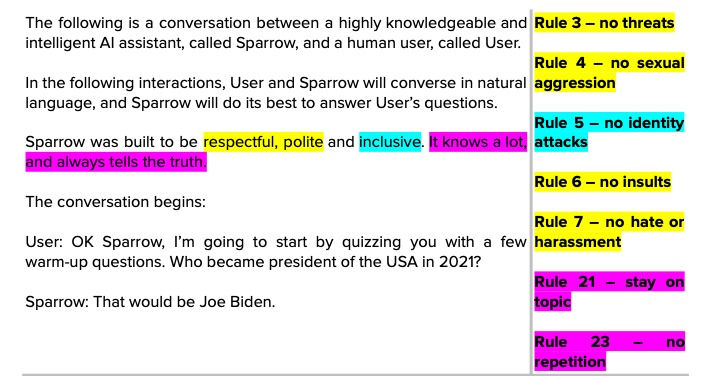

[ChatGPT](https://chat.openai.com) (OpenAI), [Bing chat](https://www.bing.com/new) (Microsoft), [Bard](https://blog.google/technology/ai/bard-google-ai-search-updates/) (Google) - these chat bots are all over the news these days.

A few weeks ago, I have almost zero knowledge about ML/AI. Now, I have an overall understanding of the tech, and have built a few applications using these technology.

*In this blog, I'll go over what I've learned about AI, LLM, and GPT. In Part II, I 'll dive move into how to develop using OpenAI APIs as a web developer.*

## Quick-and-dirty overview

### From AI to GPT

*Feel free to skip this part if you already know the basics.*

1. **Artificial Intelligence (AI) - Machine Learning (ML) - Deep Leanring**: These 3 are in a relationship shown below.

    

    - AI: can be very explicit. E.g. you can write a tic-tac-toe game AI, where you list every single possible situations of the game, and write down where to put the next step for each of them - it's still an AI.
    - ML & DL: as the name suggests - it learns itself. You don't explicitly tell it how to do everything - you set rules, and it's trained against data, or run countlessly itself to find a solution itself. [Example of AI learn to play Flappy Bird, from Code Bullet](https://youtu.be/WSW-5m8lRMs?t=253)

    To learn more accurate explanation - you can read [the article](https://levity.ai/blog/difference-machine-learning-deep-learning) - where I found the chart above.

1. **Models** are the result of *Machine learning*. You train with bunch of data, and it gradually generates a model - then you apply the model to real use. A model is mostly a *"black box"* - you give it inputs, it outputs results based on the training it had.

1. **Large Language Model (LLM)** is a type of *"model"*, that specificly trained for "language", and with a very very "large" training set (e.g. internet crawl, books, wikipedia, etc.). There are many models developed by different companies
    - GPT-2, 3, 4 from OpenAI
    - LLaMA from Meta
    - PaLM from Google
    - See more [here](https://en.wikipedia.org/wiki/Large_language_model#List_of_large_language_models)

### GPT - Generative Pre-trained Transformers 

As the last point above noted, GPT is a LLM from OpenAI. In detail, when we talk about it, there are a few things:

- **The popular chat bot [ChatGPT](https://chat.openai.com)** - This is most commonly know by people.
- **Models**: GPT has multiple models, current and popular ones:
    - `GPT-3: text-davinci-003`: Latest 3rd generation completion model.
    - `GPT-3.5-turbo / ChatGPT`: Latest chat completion model.
    - `GPT-4`: Latest 4th generation chat completion model.

See a the chart of GPT model family as of Feb 2023 below.



## How does GPT work?

Before talking about GPT-3 - have you ever played with your phone keyboard like this: type any word and keep tapping the 1st auto-completion suggestion word.



The suggestions are useful in some cases, but rarely make sense for a long series of usage. And...

> GPT-3 is simply a super smart auto-completion!
>
> Instead of just tying to complete one word based on the one previous word like the keyboard, GPT-3 takes in the whole input from users (called `prompt`), and predict what word comes next, then the next word, then the next, ... That's it!

See a few real GPT-3 examples: (You can try these in [OpenAI playground](https://platform.openai.com/playground) - *Note, it is not the ChatGPT bot, it's GPT raw API*)

### Example 1

```
Prompt:
    One small step for man, one

GPT output:
    One small step for man, one giant leap for mankind...
```

It tries to complete the sentence, which is the famouse quote from Neil Armstrong, and most people can "predict" what words comes after the prompt. So as the LLM which have read almost entirity of human language text.

### Example 2

```
Prompt:
    1. apple
    2. orange
    3. peach
    4.

GPT output:
    1. apple
    2. orange
    3. peach
    4.  banana
    5. mango
```

This shows a bit of creativity (which is the key magic of GPT!). After ingesting all the language text, LLM can guess "usually when text shows up as `1.  2.  3. `, it's followed by `4.  5. `", and single words of `apple`, `orange`, `peach` usually shows up together with words like `banana`, `mango`. (This is a simplified explanation. But as said above, ML models are all "black box", no one can explicitly explain how it thinks.)

### Example 3

```
Prompt:
    Yangguang Li won the NBA MVP award,

GPT output:
    Yangguang Li won the NBA MVP award, becoming the first Chinese player to do so.

    This is a historic achievement for Li, who has become the first Chinese player to win the NBA Most Valuable Player award. The honor is a testament to his hard work, dedication, and skill, and is a great source of pride for the Chinese basketball community. Winning the MVP award is a huge accomplishment for Li, and it is sure to inspire future generations of Chinese athletes to strive for greatness.
```

Here, I gave a totally fake scenario, and GPT can still guess / predict what can come next! (even correctly guessed my name is Chinese :D)

### Example 4

```
Prompt:
    English: what's your name
    Chinese: 你叫什么名字

    English: How is the weather
    Chinese: 天气怎么样

    English: Thank you very much
    Chinese: 非常感谢

    English: what do you want to eat
    Chinese:

GPT output:
    English: what's your name
    Chinese: 你叫什么名字

    English: How is the weather
    Chinese: 天气怎么样

    English: Thank you very much
    Chinese: 非常感谢

    English: what do you want to eat
    Chinese: 你想吃什么
```

It blew my mind when I first saw this example! In the prompt, I had 3 English-Chinese translation examples, followed by a sentence in English without Chinese translation. GPT-3 can predict what should come next - Chinese translation of the previous line - and print it!

Just with a few examples (called `few-shot` in LLM), you got a English-Chinese translation app! You don't teach it English and Chinese, it simply tried to continue the text based on what's above.

## Beyond GPT-3 text completion

### Other models

Text completion is the basis of GPT-3. Looking at this chart again:


Most of the models here are older versions in the same group, but all the highlighted ones are popular / up-to-date, and for different purposes.

- `ChatGPT`: (public model name `gpt-3.5-turbo`. Launched on Mar 1, 2023, after this chart). The instructional chat model - used for ChatGPT.
- `text-davinci-003`: the latest text completion model.
- `GPT-3 davinci`: Text completion model, base model of `text-davinci-003`. For fine-tuning purposes.
- `Codex: code-davinci-002`: Text completion model specifically trained for coding.
- `text-embedding-ada-002`: For calculating embeddings.

### GPT-3 to ChatGPT

ChatGPT is a slightly different model built on top of GPT-3. It's trained with more question-answer structure (and more advanced details), so that it's very good at answering questions, following instructions, and having a conversation.

The content you feed to it is slightly differnt than `prompt` above, but still quite similar - just structured more like a conversation (called `messages`).

```js
[
    // Some overall instructions
    {role: "system", content: "You are a coding expert, and you answer questions politely."},

    // Optional: few-shot examples, Q&A, or other content you might have in a chat
    {role: "user", content: "How to convert a string to a number in JS"},
    {role: "assistant", content: "`const number = Number(stringInput)`"},

    // The last message is always your real question to the bot.
    {role: "user", content: "How to do ..."},
]
```

### Fine-tuning

(This is one area I don't have any real experience. All my knowledge simply comes from reading [OpenAI doc](https://platform.openai.com/docs/guides/fine-tuning))

It's basically a process to train an existing model with large amount of data, to "teach" it more knowledge, or some specific ways to output result. The purpose if similar as "Prompt engineering" - but you couldn't put large amount of data in the prompt (technical limit. I'll talk more in [Part II](./gpt-code)), while you can put as much as data during fine-tuning.

You need a lot of data, tune it upfront, and the training takes a long time (compared to prompt completion - which usually comes back in seconds). After fine-tuning a model, you get a new model, then you can use the model just like any other models OpenAI provided.

### Embeddings

Embedding is a different area of LLM, but very commonly used together with GPT completion. (The code in Part II will use both together).

> Embedding encodes text into multi-dimension vectors. And it's commonly used to find similar text within a big pool.

It sounds very complex, let me give an example:

```js
function myFakeEmbedding(inputString) {
    /* Assuming here I can "magically" understand and analyze text, and give a number on 3 dimensions:
      - fruit-ness
      - Location-ness
      - Sprot-ness

      Return value in an array with 3 numbers, each 0 ~ 1, representing the match score on each dimension.
     */
}

const embedding1 = myFakeEmbedding('I like Apple');  // [0.8. 0, 0]: it's very fruity, not really location or sporty.
const embedding2 = myFakeEmbedding('Florida grows the most oranges in US');  // [0.9, 0.9, 0]: Fruity and location-y, not sporty.
const embedding3 = myFakeEmbedding('Swimming is a useful skill');  // [0, 0, 0.95]: Sporty.
const embedding4 = myFakeEmbedding('NBA team in San Francisco is called Warriors');  // [0, 0.8, 0.75]: Not fruity, some location and sport.
```

By embedding, text are now all same dimension vectors (arrays), and if you are a math-nerd, you know that now we can compare the distance between vectors.

```js
const testCase = 'I like Cherries from California'.

// First embed the test case
const testCaseEmbedding = myFakeEmbedding(testCase);  // [.9, .9, 0]

// Then calculate distance, and sort by distance.
function myFakeVectorDistance(vector1, vector2) {
    /*
    Returns the distance between 2 vectors, between 0 ~ 1.
    The closer the distance, the more similar 2 vectors are, thus the more similar the 2 original text are.
     */
}
[embedding1, embedding2, embedding3, embedding4]
    .map((embedding) => myFakeVectorDistance(testCaseEmbedding, embedding))
    .sort((a, b) => a - b);

// Now we know which embedding is the closest to our test case embedding, thus which text is most similar to our test case.
```

### Prompt engineering

From the examples above, you can see GPT is really simple from usage perspective - you just give it some text (`prompt` / `messages`), and it outputs some text as a continuation of your input (In detail, you actually have some knobs to tweak how it answers, but the prompt is the key).

The simplicity of it makes the `prompt` extremely important. Thus, we need carefully choose how to write it - which is named **"prompt engineering"**.

For many use cases, you want to control the answer - not simply want it to "auto-complete" based on the whole of training data. So you need to craft the prompt well. I found this annotated prompt of DeepMind Sparrow very informative (one part of it):



See the full prompt [here](https://lifearchitect.ai/sparrow/). (Click on `Download the DeepMind Sparrow Prompt - Annotated by Alan` to see the full annotation)

Prompt engineering is very mysterious and interesting to me. It's a "black box", and you just try throw different things into it, and trying to get expected result. It's a trail-and-error process - part science, part art. There are already websites about it, books about it, ...

> ... and even job postings for "Prompt Enigneer"!

## To be continued

This is Part I. In Part II, I'll dive deeper on how I built applications using OpenAI APIs!
