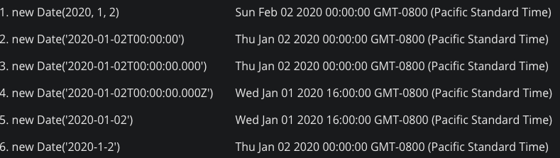

There are many weird edge, and imperfections in JavaScript, like `123 < undefined` and `123 > undefined` are both `false`, like `typeof null === 'object'`, `typeof undefined === 'undefined'`, and on and on. Many of those can be avoided if you have good coding practice, and with help of linter and/or typed language extensions like TypeScript. 

But `Date` is different. Most of the pitfalls have nothing to do with code style, variable type. They all look alright, but will give you unexpected results. I categorize this as a design flaw of JavaScript - and that's why TC39 is [proposing a new type - `Temporal`](https://tc39.es/proposal-temporal/docs/) to fix some of those problems.

So before we get that, let me go through some issues I had with `Date`...

## Create a new date

Let's start with creating a date - `new Date()`, pretty straightforward, right? If you think so, try to name the output of each of these:

<div class="_interaction-container">
  <quiz-reveal :rows="[
        {code: `new Date(2020, 1, 2)`, value: new Date(2020, 1, 2)},
        {code: `new Date('2020-01-02T00:00')`, value: new Date('2020-01-02T00:00:00')},
        {code: `new Date('2020-01-02T00:00:00.000')`, value: new Date('2020-01-02T00:00:00.000')},
        {code: `new Date('2020-01-02T00:00:00.000Z')`, value: new Date('2020-01-02T00:00:00.000Z')},
        {code: `new Date('2020-01-02')`, value: new Date('2020-01-02')},
        {code: `new Date('2020-1-2')`, value: new Date('2020-1-2')},
      ]" />
</div>

The above is what your current browser parses those. Different browsers may parse some of them differently. For comparison, below is what Chrome 86 Mac renders. (Timezone may cause your result different from mine as well, but the only point of interests are whether the hour is 0)



How many answers did you get right? Let's breakdown these traps:

### Month number is 0 - 11

The first one is easy, as you may already know `month` as a number is from index 0. If `myDate.getMonth()` is 1, then it's February. So same here, `new Date (2020, 1, 15)` has the month `1`, so it's February 15th.

### ISO string

2 and 3 has the same result. You may know they are based on [ISO string](https://www.w3.org/TR/NOTE-datetime). (You can get one by `new Date().toISOString()`). 2 and 3 are basically saying the seconds and milliseconds in the ISO string can be skipped when creating a new date.

### ISO string with timezone

The ISO string in 2 and 3 are using your local timezone (at least for my browser). **BUT**, don't rely on this! In my experience, it is not guaranteed that the date uses your local timezone. Some browsers seem to treat the time as UTC (Universal Time Coordinated, used to be called Greenwich Mean Time - GMT) time.

So if you want to use this, it's better to specify the timezone explicitly, like line 4. Timezone can be specified at the end of an ISO string by `+/-hh:mm`, or `Z` (for UTC). e.g. `2020-01-01T02:15:00Z` is the 2:15AM in timezone 0, `2020-01-01T02:15:00-08:00` is 2:15AM in timezone -8 (US Pacific/Los Angeles time). You can get your current timezone in minutes by `new Date().getTimezoneOffset()` (note, offset is the offsite number of the timezone. See detail below).

Fun fact: [The strangest time zones](https://www.youtube.com/watch?v=J1kOkoma_hM)

### yyyy-mm-dd vs. yyyy-m-d

Then it comes line 5 and 6. I would say, just *run away* from them! They're just terrible! (especially yyyy-m-d)

- First of all, you can't specify the timezone, so it's all to the browsers to choose. And as noted above, some browsers may use your timezone, some use UTC. Even within line 5 and 6, one is UTC, one is my timezone...
- And, not sure if you realized, there's no way to distinguish `yyyy-mm` and `yyyy-m` when it's Oct/Nov/Dec! So your `new Date('yyyy-m-d')` may work as you wanted at first, but once you get to Oct, it changes to local timezone! (This actually happened to one of my projects)

### Some other ways to create a date

- `new Date()`: Just the current time
- `new Date(123123123)`: A timestamp
- `new Date(2020, 0, 1, 2, 15, 0, 0)`: The full extension of example 1. The time is your local time.
- `new Date('December 17, 1995 03:24:00')`, a different type of date string. But not a common way to create a new date IMO.

See the full documentation [here in MDN](https://developer.mozilla.org/en-US/docs/Web/JavaScript/Reference/Global_Objects/Date/Date)

## Working with `<input type="date">`

<div class="_interaction-container">
  <date-input />
</div>

Play with it, and pay special attention to the year/month/day value in the input field vs below. Are you puzzled by them? Depending on your timezone, you may see the year is "2019" when you choose "Jan 1st, 2020" (e.g. in U.S.A); or year "2021" when you choose "Dec 31st, 2020" (e.g. in China).

> `<input type="date">` doesn't use a real `Date`, but a `yyyy-mm-dd` string. As if pretending not knowing `Date` exists in JavaScript.

It's all up to the developer to handle it. So with what we discussed above, you should be able to figure out why the value doesn't match. `new Date(yyyy-mm-dd)` uses UTC!

So, how should you deal with the value from an `<input type="date">`?

### Use the date in UTC

If you:
- Won't be using `.getFullYear()`, `.getDate()`, `.getHours()`, etc. (those getters all uses current timezone)
- Only need the date for things like comparing with other dates with the same format
- Or you just want to use UTC intentionally

... you can still use `new Date(input.value)`.

### Use user's timezone

You can parse the string to get year, month (don't forget to minus 1), day numbers:

```js
new Date(
  Number(input.value.slice(0, 4)),  // year
  Number(input.value.slice(5, 7)) - 1,  //month
  Number(input.value.slice(9, 10))  // day
)
```

You can set to UTC, then add back timezone offset

```js
new Date(
  new Date(`${input.value}T00:00:00.000Z`).getTime() + // UTC timestamp of midnight the selected day
  new Date().getTimezoneOffset() * 1000 * 60  // timezone offsets in milliseconds
)
```

Or calculate the timezone using `.getTimezoneOffset()`
```js
const timezoneOffsetInMinutes = new Date().getTimezoneOffset();
// timezoneOffsetInMinutes can be negative, so `Math.abs`
const hourPart = `${Math.floor(Math.abs(timezoneOffsetInMinutes) / 60)}`.padStart(2, '0'); // "08"
// Timezone can have minutes(!), you can't just assume "00"
const minutePart = `${Math.abs(timezoneOffsetInMinutes) % 60}`.padStart(2, '0');  // "00"
const timezoneSign = `${timezoneOffsetInMinutes > 0 ? '-' : '+'}`;  // Offset is the opposite number of timezone
const timezoneString = `${timezoneSign}${hourPart}:${minutePart}`;  // -08:00

new Date(`${input.value}T00:00:00${timezoneString}`)
```

Or calculate the timezone using `.toString()`
```js
// `.toString()` outputs "Tue Dec 08 2020 20:51:51 GMT-0800 (Pacific Standard Time)"
// The regex below is finding the match after "GMT", then one char followed by 4 numbers
const timezoneString = new Date().toString().match(/GMT(.[\d]{4})/)[1];  // "-0800"
new Date(`${input.value}T00:00:00${timezoneString}`)
```

## Timezone in `Date`

### There's no "timezone" in JavaScript `Date`

> Timezone is not part of `Date`

That's right. You may see `new Date(); // Tue Dec 08 2020 17:55:57 GMT-0800 (Pacific Standard Time)` when you print it out - with the timezone string at the end. **BUT, the timezone is actually not there.** The real content of a `Date` is always only a timestamp (number of milliseconds since Jan 1, 1970, UTC midnight), and your browser know what timezone you are in, and "translates" the timestamp into a time in your timezone.

You can get current user's timezone by `.getTimezoneOffset()` or `.toString()`. See the example above.

Bonus: you can also get a human-readable timezone string like "Pacific Standard Time" by `new Date().toString().match(/\((.*)\)/)[1]`.

### Use timestamp number whenever possible

A timestamp number is always easy to understand, and there's no timezone issue at all. So it's commonly used in databases when the data needs to be used by users in different timezones.

One quick tip is you can `Date.now()` to get current timestamp, which is a few characters shorter than `new Date().getTime()`.

## Some nice things around `Date`
let options = { weekday: 'long', year: 'numeric', month: 'long', day: 'numeric' };

console.log(date.toLocaleString('en-US', { weekday: 'long', year: 'numeric', month: 'long', day: 'numeric' }));
### `Date.toLocaleString` and `Intl.DateTimeFormat`

`Date.toLocaleString` and `Intl.DateTimeFormat` are basically identical (see 6 vs 7). Super awesome native APIs, with many format options and internationalizations! 

<div class="_interaction-container">
  <quiz-reveal :rows="[
        {code: `new Date().toLocaleString()`, value: new Date().toLocaleString()},
        {code: `new Date().toLocaleDateString()`, value: new Date().toLocaleDateString()},
        {code: `new Date().toLoTimecaleString()`, value: new Date().toLocaleTimeString()},
        {code: `new Date().toLocaleString('zh-CN')`, value: new Date().toLocaleString('zh-CN')},
        {code: `new Date().toLocaleString('ko-KR')`, value: new Date().toLocaleString('ko-KR')},
        {code: `Intl.DateTimeFormat('zh-CN', {weekday: 'long', month: 'long'}).format(new Date())`, value: Intl.DateTimeFormat('zh-CN', {weekday: 'long', month: 'long'}).format(new Date())},
        {code: `new Date().toLocaleDateString('en-US', { weekday: 'long', year: 'numeric', month: 'long', day: 'numeric' })`, value: new Date().toLocaleDateString('en-US', { weekday: 'long', year: 'numeric', month: 'long', day: 'numeric' })},
        {code: `Intl.DateTimeFormat('en-US', { weekday: 'long', year: 'numeric', month: 'long', day: 'numeric' }).format(new Date())`, value: Intl.DateTimeFormat('en-US', { weekday: 'long', year: 'numeric', month: 'long', day: 'numeric' }).format(new Date())}
      ]" />
</div>

### `Temporal`

[Temporal](https://tc39.es/proposal-temporal/docs/) is a new proposal in TC39 (Ecma International, Technical Committee 39 - ECMAScript, basically the group that defines JavaScript - like all the ES6+ goodies we got these years). It tries to solve all the messy timezone issues and more on current JavaScript `Date`. Let's look forward to it!

### Moment.js (maintainance mode)

Moment.js has long time been the go-to library for date and timezone related features. But they recently announced they are switching to "maintainance mode", and encourages users to migrate away from them. [momentjs.com](https://momentjs.com/docs/#/-project-status/).
