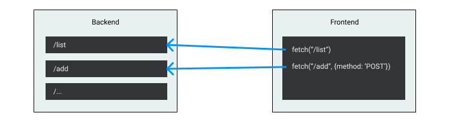
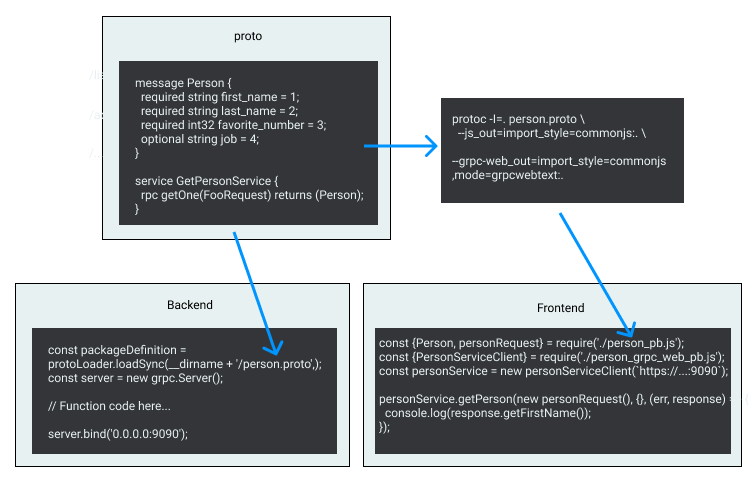

REST, gRPC, and GraphQL are the three main solutions for APIs nowadays. In detail, they are 3 very different things (not even talking about implementation and how to use).

- REST (REpresentational State Transfer) is a software architectural style. It's a **style**. You can understand it like - we have HTTP, and engineers found out a code structure style that works very well for backend-frontend communication via HTTP.
- gRPC [grpc.io/](https://grpc.io/) is an open-source framework (Originally developed by Google). It is a **framework**. So you use it just like other frameworks/libraries - you install it by cloning the GitHub repo, or from a package manager (e.g. Web runtime library is `npm i grpc-web`). It supports all the common backend/frontend languages.
- GraphQL [graphql.org/](https://graphql.org/) is a data query language. Originally developed by Facebook, now open-source. It is a **language**. So you use a library that implemented this language. (just like SQL, you cannot "download SQL", you download softwares like MySQL that implemented the SQL language. and use SQL language to work with the data). There are many implementations of GraphQL. [graphql.org/code/](https://graphql.org/code/) has a list implementations in different languages (Note that it has server libraries for the backend to implement the API, and client libraries for the front end to use the API). One notable big player is [Apollo](https://www.apollographql.com/).

(Interestingly, I just found out on Wikipedia - Both gRPC and GraphQL started since 2015.)

Tech jargon aside, we can simplify them as three ways to build & use APIs.

## REST

This is the most well-known type - whether you heard of the terms "REST", "RESTful API", if you have used an API, that you can simply call via `curl` command in bash of `fetch` in JavaScript, you are using REST API.

To start, this is a basic structure of REST APIs.



### Implementation

The design of REST API is fairly straightforward: The backend exposes a path. Whenever an HTTP request hits the path, do something and respond back data.

Here's the backend implementation (example in Express.js). 

```javascript
// The structure looks like this:
app[method](path, (req, res) => {
  // Do the job
  res.status(code);
});

app.get('/list', (req, res) => {
  // Do the job here - like query the database to find all items
  const result = ['a', 'b', 'c'];
  res.status(200).json({result});
});

app.post('/add', (req, res) => {
  const newItem = req.body;
  // Do the job here - like add item to the database
  res.status(200).json({message: 'Added!'});
});
```

The front end can then call them via the matching method and path. (example in JavaScript)

```javascript
fetch(`${URL}/list`)  // Default method is GET, can be skipped.
    .then(res => res.json())  // Because the response is sent by `.json()`
    .then(data => console.log(data));  // Logs `['a', 'b', 'c']`


fetch(`${URL}/add`, {method: 'POST', body: JSON.stringify({name: 'd'})})
    .then(res => res.json())  // Because the response is sent by `.json()`
    .then(data => console.log(data));  // Logs `{message: 'Added!'}`
```

### Pros and Cons

- Pros
  1. Just HTTP calls. HTTP is the backbone of the web, so any platform / language come with it. You use it almost anywhere - within your app, inside browser devtool, or just `curl`.
  1. Easy to build. As you can see above, it's just a few lines of code to build and use REST API. (But building a good one definitely requires more work)
- Cons
  1. Need the backend and the frontend in sync. As you can see, there's no contract between the backend and the frontend. The frontend has to know the path, method, request format, etc. And whenever the backend changes, the frontend also needs to keep changes in sync manually.
  1. Easy to write messy APIs. You have the total control of what you do, so you can have APIs with inconsistent naming, behavior. E.g. Nothing prevents you from making `GET /list` delete all the items.

## gRPC

This might be the less well-known one (REST is the oldest, with native support. And GraphQL is the new hotness recently.). It's widely used inside Google, and a few more big-name companies.

### High-performance, minimal payload

From the slogan "A high-performance, open-source universal RPC framework", you can see the emphasis on **performance**. Let's see an example comparing sending a JSON data via REST vs gRPC.

Let's say we want to get information about a user. The end result we need is like this:
```json
{"firstName": "Yangguang", "lastName": "Li", "favorateNumber": 3, "job": "UX Engineer"}
```

If we transfer this data via REST, we just send the JSON itself. It's **85 characters** (excluding whitespaces). But it's obvious that the useful data is just "Yangguang", "Li", and "UX Engineer". The key names are just the structure. But they still need to be transferred.

Why not just transfer the data? Here comes gRPC! In gRPC, the structure is defined in the code, and only data is transferred. So the HTTP payload for the above example is:
```json
["Yangguang", "Li", 3, "UX Engineer"]
```

It's just **36 characters**, **58%** smaller than the size of REST response! (Characters length is not the accurate indicator of the payload size, but the comparison is still valid). And this is the minimal way to transfer all the information we want.

### Data structure

You may ask "How about the data structure?". It's obvious that `person.favorateNumber = res[2]` looks terrible, and prone to error. gRPC handles it by defining the structures (in `proto`s), and compile it into server-side and client-side modules. So you don't ever handle the response error by yourself. Quick preview - you actually read the data like `person.favorateNumber = res.getFavorateNumber()`.

```proto
/* The data structure part of proto looks very similar to an Interface declaration in TypeScript */
message Person {
  required string first_name = 1;
  required string last_name = 2;
  required int32 favorite_number = 3;
  optional string job = 4;
}

/* And endpoints are defined in the same file, called `rpc` */
service GetPersonService {
  rpc getOne(FooRequest) returns (Person);
}
```

With compiled proto, all fields in `message` will have it's getter and setters - `person.getFirstName()`, `person.setFavoriteNumber()`. And services are all wrapped in `serviceClient`.

### Implementation

Once you have the proto definition, you load the proto file into your backend to implement the API features. And you run a command to generate the client-side code and use that in the frontend code. 



The detailed code is a bit long for a blog, you can check out the full process in [this GitHub example](https://github.com/grpc/grpc-web/tree/master/net/grpc/gateway/examples/helloworld), or the [official tutorial](https://grpc.io/docs/tutorials/basic/node/#defining-the-service).

### Streaming

One cool feature of gRPC is streaming. It allows the backend to send updates of an endpoint to the frontend. For example, the UI displays stats of a system that comes from the backend. In REST cases, you may hit the endpoint every X time to refresh the data. But in gRPC, you can use "stream" services to watch changes.

```proto
service MyService {
	rpc MyStream (MyRequest) returns (stream MyResponse) {}
}
```

```javascript
const streaming = service.myStream(new MyRequest(), {});
streaming.on('data', (response) => {/* Do something with MyResponse */});
```

### Pros and Cons

- Pros
  1. Single source of truth. Both the backend and the frontend uses the proto files as the source of truth.
  1. Enforced data structure. You can only interact with the API and data via the proto generated classes. So you always use the data according to the proto definition.
  1. Performance. The payload is the minimal possible size.
  1. Comes with streaming support. No need to build your own WebSocket to handle it.
- Cons
  1. Too complex. This might be the biggest reason why it's not so popular. You need several layers of knowledge to start use gRPC - Protocol buffer, server-side config, proxy, client-side stub, etc. Having used gRPC both internally at Google and externally in open source projects, the setting up and config process takes a lot of my time and energy.

## GraphQL

There are a few similarities between GraphQL and gRPC:

- Both define the data type before using
- Both run as a single endpoint on the server
- Both solve the REST's problem of sending redundant data

But they are also diffent:

- Data typing: GraphQL defines the data type only in the backend. Directly in your code. So there's no complex handling of passing it to the client-side.
- Serving is fairly straightforward. No complex proxy, etc.
- It solves the problem of unused fields and chain request.

Let's see the details!

### Query

The coolest part of GraphQL is the query. It has two main advantages - filter only fields needed, and simplify chain requests.

In the above example, both REST and gRPC return the full response - first name, last name, favorite number, and job. But if the client only needs the first name and favorite number, all other fields are not needed.

In GraphQL, you can request for only what you need:

```graphql
{
  person {
    firstName
    favoriteNumber
  }
}
```

This query returns just `{"firstName": "Yangguang", "favoriteNumber": 3}`.

You can also chain any requests. Let's say in a book list app. We can get the list of book ids from an anthor id. And from the book id to get book information. If we want to render a list of all books from a user, in the REST world:

```javascript
function getAllBooksBy (authorId) {
  return fetch('/author/${authorId}').then((res => res.json())).then((author) => {
    Promise.all(author.bookIds.map((bookId) => {
      return fetch('/book/${authorId}').then((res => res.json()));
    }))
  });
}
```

So it's N + 1 requests. But in GraphQL, you can query it just in one request:

```graphql
query {
  author(id: authorId) {
    name
    book {
      title
      price
    }
  }
}

```

### Implementation

The backend defines the GraphQL schema. And runs it on a port. 

Since GraphQL is just a language spec, not a framework, the coding details are different between implementations.

```javascript
const express = require('express');
const graphqlHTTP = require('express-graphql');
const { buildSchema } = require('graphql');

const schema = buildSchema(`
  type Person {
    firstName: String
    lastName: String
    favoriteNumber: Int
  }

  type Query {
    user(id: String): User
  }
`);

const rootValue = {
  user: ({id}) => {
    return getPersonFromDatabase(id);
  }
};

var app = express();
app.use('/graphql', graphqlHTTP({schema, rootValue}));
app.listen(4000, () => console.log('Successful'));
```

The frontend implementation varies even more than the backend. Many implementations have integrated with UI frameworks to be used easily. This is an example of using a lightweight client "graphql-request":

```javascript
import { request } from 'graphql-request'

const query = `{
  Movie(title: "Inception") {
    releaseDate
    actors {
      name
    }
  }
}`

request(URL, query).then(data =>
  console.log(data)
)
```

### Pros and Cons

- Pros
  1. Flexible query format. This is the beauty of GraphQL - any fields, any chaining.
  1. Good community and rich integration options. There are implementations of GraphQL on most popular backend & frontend frameworks.
  1. Relatively easy to setup.
- Cons
  1. No "official" implementation, and implementations differ from each other. So when you switch between projects using different implementations of GraphQL, you need to switch your mind.
