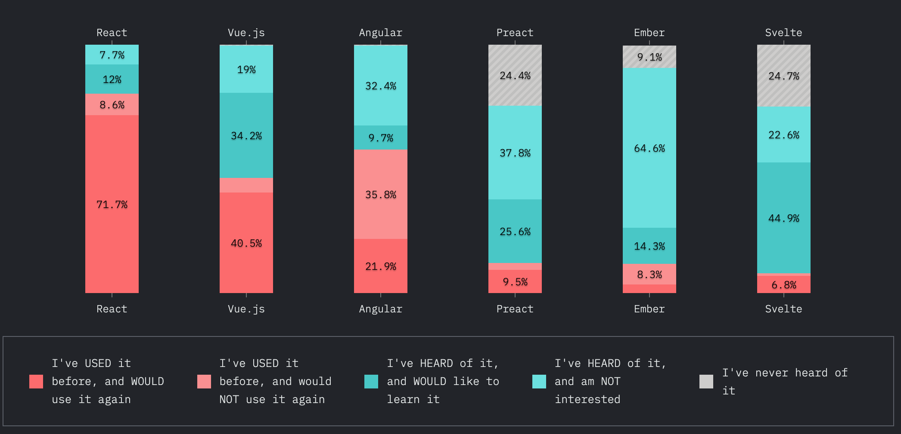
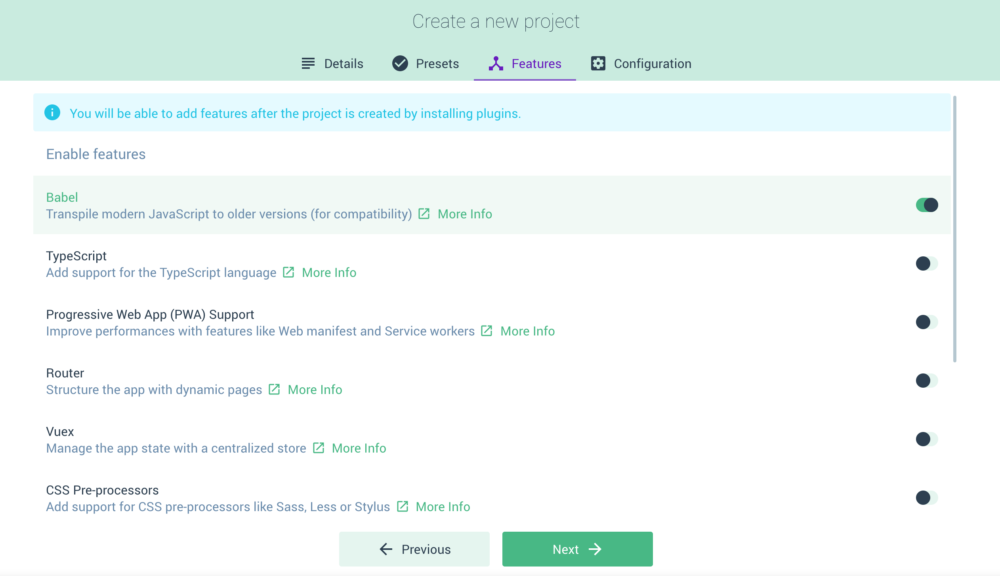

## Quick overview

(I'll not distinguish library vs framework, I'll just call them all "framework" in this article.)

If you ask a random web developer to list framework/library, I'm sure most people will say "React" and "Angular", less people would add "Vue", "Svelte" and more. But Vue is actually not a small pet project, it has a quite a big user base. At the time I'm writing this, GitHub stars (I know, I know, this is not the best metric) for some common frontend frameworks are:

- Vue: 169K
- React: 153K
- Angular: 63K
- Svelte: 40k



Vue actually has the most stars. And in [state of js 2019](https://2019.stateofjs.com/front-end-frameworks/), Vue is the 3rd well-knwon framework, and the **highest satisfaction** among developers used it. I definitely "+1" this! I've built many websites/webapps using React, Angular (1 and 2+), Vue, LitElement. Not only personal projects, but real projects with thousands of users. (I just realized I happened to have thousands+ users apps on each of the 4 frameworks, so I guess I'm somewhat qualified to comment on this topic :P)

> Vue is the framework with the least distraction, and best developer experience. So you can just focus on your product

I'll elaborate this, and compare it to React and Angular along the way.

## Ramp up experience

No webpack, config, processing needed, and doesn't break the usefulness. (Impossible in Angular. Possible in React, but not practical).

```html
<!-- This just works. Try copy it as a html file, or copy to codepen  -->
<script src="https://cdn.jsdelivr.net/npm/vue"></script>

<div id="app">
  <input v-model="message">
  {{ message }}
</div>

<script>
new Vue({
  el: '#app',
  data: {
    message: 'Hello Vue!'
  }
});
</script>
```

So Vue can be easily included into any environment - a web app from scratch, an existing web app on any framework, a chrome extension, an app script...

And obviously you can have a more advanced setup with compilation, npm packages, etc. Vue provides a great CLI to help you with it, which handles all the setup, packages, webpack config, and more. With the advanced approach, you can also write components in a nicely contained `.vue` file.

### Back to the basic of web technologies

> HTML for the content, CSS for the styles, JS for the interactions

We are know this is the backbone of the web. Then why not build web apps following this? No JSX, no CSS in JS - just ✅ HTML as the base, ✅ `<style>` for CSS, ✅ `<script>` for JS. 

Angular forces everyone to use Typescript and RxJs, React forces everyone to use JSX and pick a CSS in JS solution. Vue doesn't force any choice. It's just the basic of the web, you can choose whatever you want.

```html
<!-- Hello.vue -->
<template lang="pug">
div
  p {{ greeting }} World!
  OtherComponent
</template>

<script>
import OtherComponent from './OtherComponent.vue'

export default {
  components: {OtherComponent},
  data () {
    return {
      greeting: 'Hello'
    }
  }
}
</script>

<style lang="scss" scoped>
p {
  font-size 2em
  text-align center
}
</style>

<style lang="scss">
p {
  font-size 2em
  text-align center
}
</style>
```

This is an example of vue component file. Each part is just used as how they are designed for the web.

- `<template>` is the template/html
    - You can use any dialect of html. I like to use [`pug`](https://pugjs.org/api/getting-started.html), which makes the HTML cleaner and easier to read.
- `<script>` is the script code
    - It does all the work: fetch data, handle states, import child components - just like in any other frameworks.
- `<style>` is the style code
    - Same as the template, you can use any pre/post processor like `scss`, `less`, `postcss`
    - Note the `scoped` attribute, which does exactly it says.

## Nice feature

This part is mostly comes with the comparison / frustration of using Angular (mostly...) and React. No component / module stuff like Angular. 👎

### Component management

Similar to React, file based components, import just like any ES module. And can be organized in any folder / file structure.

### Overall syntax

```jsx
import ChildComponent from '../ChildComponent.vue';

export default {
  components: {ChildComponent},  // Declare imported components
  props: ['product'],  // Input from parents
  data() {  // Value defined in this component
    return {
      price: 0,
    };
  },
  async created() {  // Life cycle methods
    this.price = await this.calculatePrice(this.product.productId);
  },
  methods: {  // All the methods
    calculatePrice(productId) {
      // ...
    },
  },
});
```

### Scoping css, and deep css

```html
<style lang="scss" scoped>
// scoped css
</style>

<style lang="scss">
// non-scoped css
</style>
```

It's just this easy, no fancy `::ng-deep` needed. Clearly managed.

### Conditional rendering

```html
<p v-if="isExamPassed">Congratulations!</p>
<!-- there's also `v-else-if="condition" -->
<p v-else>Eh oh...</p>
```

It's much easier to read than React's `isExamPassed ? <p>Congratulations!</p> : <p>Eh oh...</p>` and Angular's (come on...):

```html
<!-- Angular example -->
<ng-container *ngIf="isExamPassed; then passed; else failed"></ng-container>
<ng-template #passed> <p>Congratulations</p></ng-template>
<ng-template #failed> <p>Eh oh...</p></ng-template>
```

### Loop and conditional together

```html
<ul>
  <li **v-for="(item, index) in list" v-if="item.isAvailable"**>{{index}} {{item.name}}</li>
</ul>
```

Comparing to React:

```html
<ul>
  {list
     .filter((item) => item.isAvailable)
     .map((item, index) => <li>{index} {item.name}</li>)}
  <!-- OR, use `reduce` to have it in one run, but loses some readability -->
</ul>
```

... and Angular:

```html
<!--
  - Do not support two sturctural directives (ngFor and ngIf) on one element.
  - Getting index is a weird syntax.
-->
<ul>
  <li *ngFor="let item of list; let i = index">
    <ng-container *ngIf="item.isAvailable">{{i}} {{item.name}}</ng-container>
  </li>
</ul>
```

### Computed

```html
<template lang="pug">
div
  p {{age}}
  input(v-model="firstName")
  input(v-model="lastName")
  p Hello **{{fullName}}**
</template>

<script>
export default {
  prop: ['foo'],
  data () {  // similar to "state" in React
    return {
      firstName: '',
      lastName: '',
      age: 18,
    }
  },
  **computed: {
    fullName() {return `${this.firstName} ${this.lastName}`}
  },**
}
</script>
```

It's auto updates when any of the dependencies changes. Similar to `useEffect` in React, but this will auto list the dependencies in the background. (If you do need to specify other updating behavior, you can use `watcher`)

### Vuex syntax (Flux)

```jsx
// store.js
import Vue from 'vue'
import Vuex from 'vuex'

Vue.use(Vuex)

export default new Vuex.Store({
  state: {
	  count: 0
	},
  mutations: {
		increment (state) {
	    state.count++;
	  },
	},
})

```

```jsx
// Component.vue
export default {
  computed: {
    count() {return this.$store.state.counter},
  },
  methods: {
    addButtonClick() {
      this.$store.commit('increment');
    },
  },
});
```

## CLI with a user friendly UI

If you want to have a more complex set up, vue has a great CLI, with user friendly UI. It wraps npm, webpack, and various plug-ins for you. You can pick technologies, config plugins, add npm packages all in a UI.



## Ecosystem

A great talk by Evan You (the creator of Vue.js) - [**Seeking the Balance in Framework Design**](https://www.youtube.com/watch?v=ANtSWq-zI0s&vl=en)

React is small scope - only handles UI layer, and let the community handle others. And we had heated debates on CSS in JS, incompatible implementations of Flux, router.

Angular is large scope - handles (dictates) everything. Almost everything need to be written in the Angular way - http call, router, tests, etc.

Vue, in Evan's word, is "Progressive scope". Common problems like [Router](https://router.vuejs.org/), [Vuex](https://vuex.vuejs.org/), [Server side rendering](https://ssr.vuejs.org/) are provided by the core team, but not part of the core library. So you have the freedom to use your own, but has a clear guidance if you just need something to work.

## References

- Vue has **[the best official documentation](https://vuejs.org/)** I see from any frameworks
- Official **[comparison with other frameworks](https://vuejs.org/v2/guide/comparison.html)**
